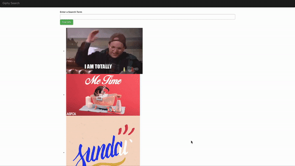

# Giphy Search Lab 

You will be building out the following project using React's `useEffect` and `useContext` hooks. You **must** fetch to the Giphy API and you **must** manage state using Context for this assignment. 

## Demo of App



## Features

1. When a user first load the app, they should see 3 gifs from today's [Trending Gifs](https://developers.giphy.com/docs/api/endpoint#trending) **as an unordered list**.
2. The user should be able to [search for gifs](https://developers.giphy.com/docs/api/endpoint#search). You app should update the gifs on the page, displaying 3 at a time, **every time the user clicks the Find Gifs button**. 

## Set Up

Run `npm install` to download dependency. Then run `npm start` to run the app.

## Starter Code

There is a good amount of starter code created for you. Take some time to draw out the component hierarchy. Take your time to really understand each component and how they work will with each other. **You are allowed to create as many additional components as you want**.

## API 

You will be using the [Giphy API](https://developers.giphy.com/docs/api#quick-start-guide) and will need to register for an API key.

The endpoints you can use are:

```
https://api.giphy.com/v1/gifs/trending?api_key={API_KEY}&limit=3&rating=g
```

```
https://api.giphy.com/v1/gifs/search?api_key={API_KEY}&q={query}&limit=3&rating=g
```
